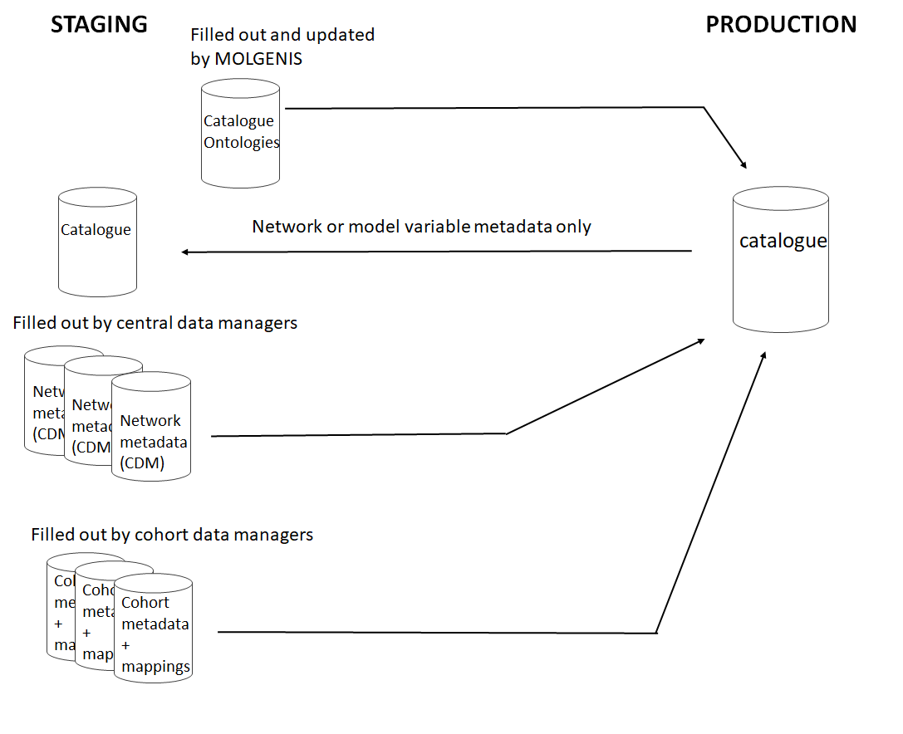

#Data flows for data catalogue staging areas

We use staging areas for data managers to upload their network or cohort variable metadata and cohort mappings.
Data managers of cohorts get access to databases on a server to upload their data using templates in a preloaded model, which is a derivative of the [full data catalogue model](https://github.com/molgenis/molgenis-emx2/blob/master/data/datacatalogue/molgenis.csv): 
Links to the models and how to set up staging areas for the data cataloge are [here](https://github.com/molgenis/molgenis-py-catalogue-transform/datamodels)

#Databases

STAGING can contain four different types of ‘databases’:
Catalogue – The data in tables Resources, Networks, Tables, Variables, VariableValues, RepeatedVariables from all Networks and Models in PRODUCTION catalogue. Data flow is from PRODUCTION to STAGING. All releases are taken out of the model.

CatalogueOntologies – All OntologyTerms tables. Data flow is from STAGING to PRODUCTION, so that changes can be made in STAGING and then copied to PRODUCTION. Changes are made on request by MOLGENIS data managers.

Networks – e.g. LifeCycle, ATHLETE, LongITools. Central data managers fill out CDM here. Versioning is handled by central data managers. Data flow is from STAGING to PRODUCTION. The data model can be found here: https://drive.google.com/drive/folders/1zts1USXV78CB-4bnxQlIFEGCKoEZ_oB5, network_model.zip

Cohorts – e.g. BIB, ALSPAC. Cohort data managers fill out dictionary and mappings to a or more CDMs here. Versioning is not applied (for now all versions are set at 1.0.0). Data flow is from STAGING to PRODUCTION. The data model can be found here: https://drive.google.com/drive/folders/1zts1USXV78CB-4bnxQlIFEGCKoEZ_oB5, cohort_model.zip

PRODUCTION contains one database:
catalogue – consists of the whole datamodel at: https://github.com/molgenis/molgenis-emx2/blob/master/data/datacatalogue/molgenis.csv

